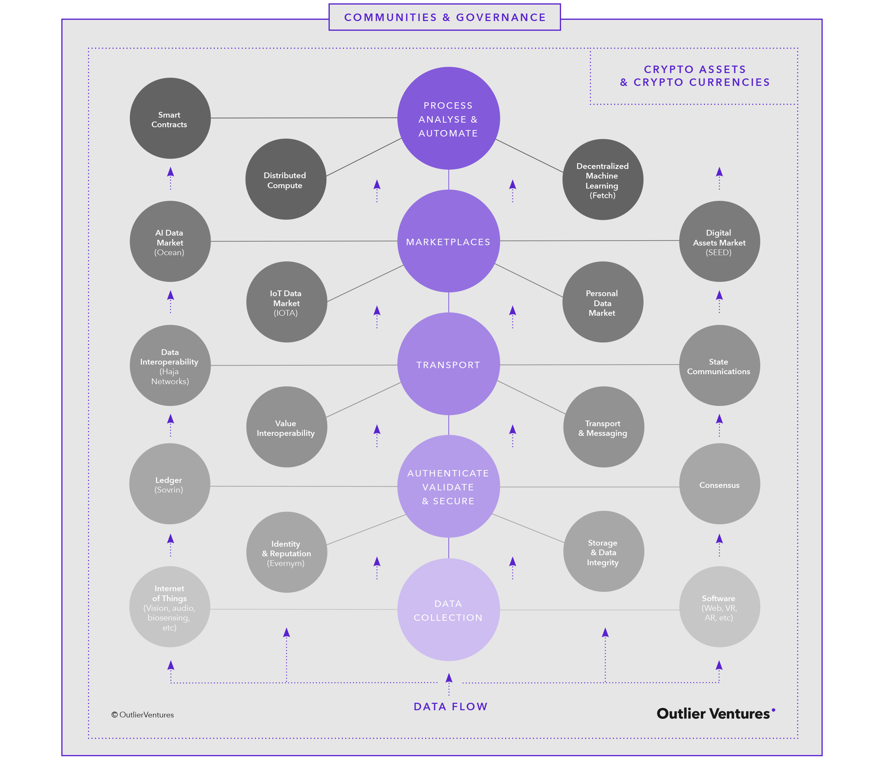

The [Convergence Ecosystem](https://outlierventures.io/investment-strategy/) sees data captured by the Internet of Things, managed by blockchains, automated by artificial intelligence, and all incentivised using crypto-tokens. The Convergence Ecosystem is open-source, distributed, decentralised, automated and tokenised and we believe it is nothing less than an economic paradigm shift.

H2O is an app in the Convergence stack, sitting between Data Interoperability and the AI Data Market. It bridges Haja Networks and Ocean Protocol, and would not have been possible without the excellent tools made available by these pioneers of Convergence.

We encourage developers to help us further the Convergence Ecosystem, so please take a look at the H2O codebase and the great frameworks used to build H2O:

#### H2O

- [H2O on GitHub](https://www.github.com/OutlierVentures/H2O): the H2O codebase which you are most welcome to run and fork.

#### Haja Networks

- [OrbitDB](https://github.com/orbitdb/orbit-db): a distributed, serverless P2P database available in Node and browser JS flavours. Node OrbitDB is used by H2O.

#### Ocean Protocol

- [Ocean Protocol Documentation](https://docs.oceanprotocol.com/): the main starting point for building on Ocean Protocol.
- [Squid-Py](https://github.com/oceanprotocol/squid-py): client library for using the Ocean stack in Python.
- [Docker Images](https://github.com/oceanprotocol/docker-images): Docker images for quickly spinning up Ocean components and getting used to the Ocean stack. Used by the standard launch of H2O (Keeper and Aquarius images).
- [Keeper Contracts](https://github.com/oceanprotocol/keeper-contracts): Solidity contracts for Ocean Protocol implementing [Token Curated Registries, Curated Proof Markets and the Ocean token](https://oceanprotocol.com/tech-whitepaper.pdf). Used by H2O for Kovan testnet deployment.
- [Aquarius](https://github.com/oceanprotocol/aquarius): metadata manager for data assets published to Ocean Protocol. Can be optionally used for H2O with Kovan.

#### Web 3 tools

- [Parity](https://github.com/paritytech/parity-ethereum): Ethereum client. Used for Kovan-flavoured H2O.
- [Truffle HDWallet Provider](https://github.com/trufflesuite/truffle-hdwallet-provider): mnemonic-focused wallet provider. Comes as an NPM package.
- [MetaMask](https://metamask.io/): Ethereum wallet browser extension.
- [Infura](https://infura.io/): Ethereum and IPFS API.
