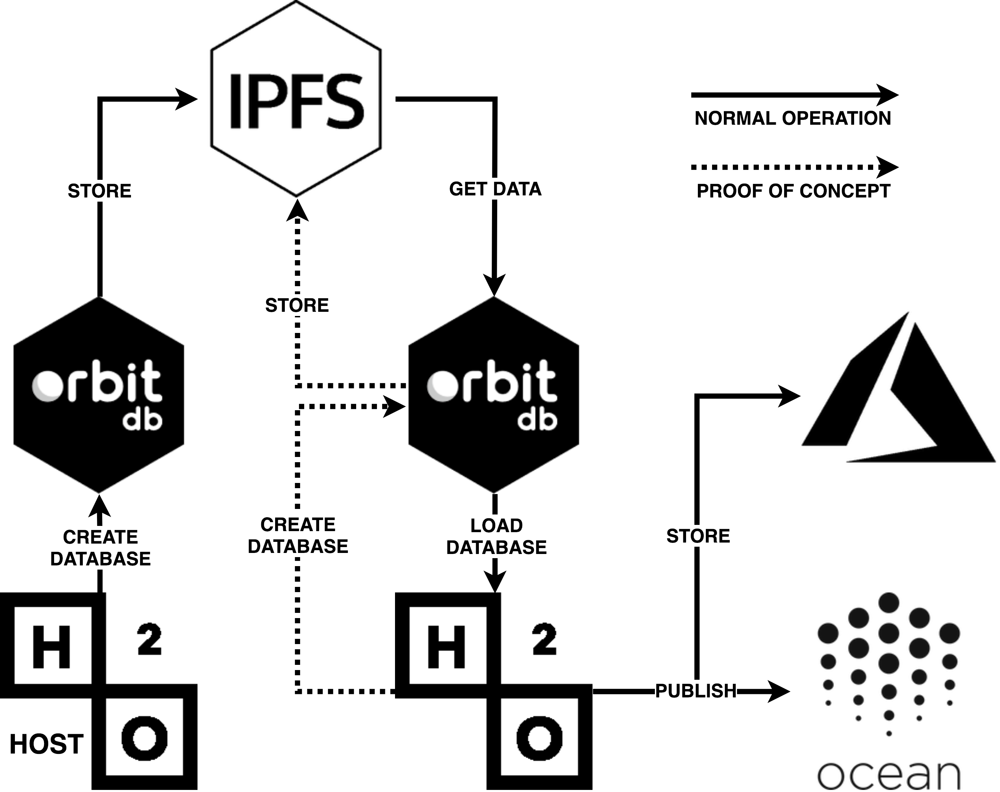
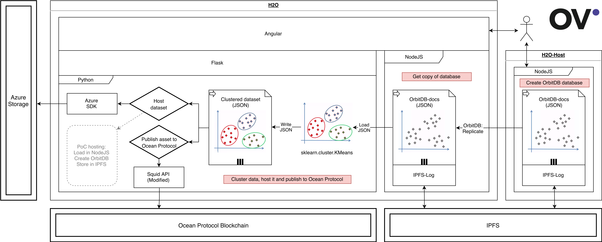

H2O, put simply, performs machine learning on OrbitDB data and publishes the result to Ocean Protocol.

This app runs the Ocean Protocol Trilobite release code and latest OrbitDB.

Get the code:
```
git clone https://github.com/OutlierVentures/H2O.git
```

You can find a live version of H2O at [h2o.apps.outlierventures.io](https://h2o.apps.outlierventures.io/home).

Publishing assets requires an Azure Storage account.
Proof-of-concept OrbitDB hosting can be found in `backend` folder, see `app.py` and `host.js`.


#### Architecture



H2O works with any dataset that can be clustered with SciKit Learn's `kmeans` function hosted using OrbitDB. This is a set of datapoints with each dimension stored as a separate entry in an OrbitDB docs type database. To fetch your database, just enter your OrbitDB address in the H2O UI.

If you just have raw data (JSON format), you can upload this to a docs type database using the H2O-Host component. You can find the repo for H2O-Host [here](https://www.github.com/OutlierVentures/H2O-Host). The repo also includes a data generation script if you don't have any data yourself but still want to test H2O and generate some processed datasets for training AI.


#### Let's start, already!

H2O runs on Linux and MacOS with command line tools.

The commands below assume you are working from the H2O directory.

##### Install components

```
sudo ./install
```
If you encounter any install problems, there is a full requirements list at the bottom of this file for manual installations.

##### Running components (local deployment)

Start an instance of Ocean Protocol:
```
./launch_ocean
```
Ensure Ocean is up and running before launching H2O - see the container output logs or use this script:
```
./backend/scripts/wait_for_migration_and_extract_keeper_artifacts.sh
```

In another teminal window, launch H2O:
```
./launch_h2o
```

Interact with the app in your browser at `0.0.0.0:4200`.


#### Using the Kovan testnet

For the adventurous: take a look at the [kovan page](/using-kovan/).




#### Deployment

You can run an H2O client using nginx.

Move H2O to `/var/www/your-domain-name.example`.

You can quickly set up an nginx configuration using [nginxconfig.io](https://nginxconfig.io/). 

*Set up HTTPS since users will be supplying an Azure storage key.*

Get an instance of Ocean Protocol up and running, whether local or using Kovan.

In one `screen` tab:
```
cd frontend
sudo ng build --watch --output-hashing=all
```
Output hashing is needed to prevent browsers loading their cached copies of the graphed datasets.

Point nginx to the `dist` folder `ng-build` produces (will be in `frontend` next to `src`).

In another:
```
cd backend
sudo python3 app.py
```

You can now disconnect from your screen session and H2O will continue to run.


### Full requirements list

If you encounter errors with the install script, here is a full list of requirements:

H2O runs on Linux and MacOS.

- MacOS: command line tools, Homebrew
- Linux: GCC 4+
- Python 3 (`python3-dev` on Linux)
- Pip3
- Node 8 (strictly version 8 - this is because of `node-gyp`)
- NPM 6+
- Angular CLI 1+
- Yarn 1.10+
- Finally, install dependencies:
    ```
    pip3 install --upgrade setuptools
    pip3 install wheel
    cd backend
    pip3 install -r requirements.txt
    npm install orbit-db ipfs
    cd ../frontend
    yarn install --pure-lockfile
    ```
